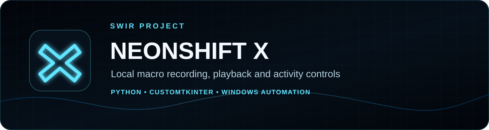
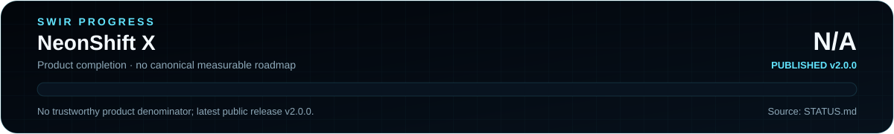

<!-- SWIR-README-STANDARD:v2 -->

<div align="center">



<br>


[](https://github.com/Swir)
[](https://github.com/Swir/NeonShift-X/stargazers)

<br>

[**Highlights**](#-highlights) · [**Quick Start**](#-quick-start) · [**Controls**](#-safety--controls) · [**Status**](STATUS.md) · [**Releases**](#-releases)

</div>


## 📍 Project Status



| Item | Status |
|---|---|
| Current source version | `2.0 NEON` |
| Primary platform | Windows |
| Latest public release | [v2.0.0](https://github.com/Swir/NeonShift-X/releases/tag/v2.0.0) |
| Public release assets | Windows EXE + portable ZIP + SHA256 |
| Product completion | **N/A** — no canonical measurable roadmap/denominator exists |
| Detailed status | [STATUS.md](STATUS.md) |

The release version, package size and documentation completeness are not used as a product-completion percentage.

## 🚀 Overview

**NeonShift X** is a Windows-focused desktop macro recorder, playback engine and configurable activity utility written in Python. It records local mouse/keyboard input, lets the user inspect and replay captured macros, and provides bounded pointer-activity modes through a neon CustomTkinter control center.

The project is designed for transparent local automation. Use it only on your own system and only where automation is permitted.

## ✨ Highlights

| Feature | What it does |
|---|---|
| 🖱️ Mouse recording | Captures movement, clicks and scroll events |
| ⌨️ Keyboard recording | Stores key-down and key-up events for more accurate modifier combinations |
| ▶️ Playback | Replays recorded events with configurable speed and repeat count |
| 🎮 Activity Engine | Provides Move & Return, Drift and Micro Jitter modes |
| 🛑 Emergency controls | F8 global stop plus PyAutoGUI fail-safe behavior |
| 📊 Local telemetry | Tracks moves, clicks, keys, macro runs and activity pulses |
| 🔎 Macro inspector | Summarizes recorded macro content |
| 💾 Local configuration | Saves settings and macro data beside the application |

## 🖼️ Current Application Artwork

The project already includes its own cyberpanther artwork used by the application. It is preserved rather than replaced by a generic screenshot.


## ⚙️ Quick Start

### Recommended — Windows release

Download **[NeonShift X v2.0.0](https://github.com/Swir/NeonShift-X/releases/tag/v2.0.0)**. The public release provides `NeonShift-X.exe`, a Windows x64 ZIP and SHA256 checksum.

### From source

```bash
git clone https://github.com/Swir/NeonShift-X.git
cd NeonShift-X
python -m pip install -r requirements.txt
python NeonShift_X.py
```

Windows convenience scripts are also present:

```text
INSTALUJ.bat
START.bat
```

## 📋 Requirements / Compatibility

- Python **3.10+** according to the current project guidance.
- Runtime dependencies: CustomTkinter, PyAutoGUI, Pynput and Pillow.
- Tkinter must be available in the Python installation.
- The application is Windows-focused and the public v2.0.0 package is a Windows build.
- Live GUI behavior still depends on a working desktop/Tk environment; a prior validation note recorded Tcl/Tk initialization as unavailable in the test environment used at that time.

## 🛑 Safety & Controls

- **F8** — global Emergency Stop for recording, playback and the Activity Engine.
- **ESC** — stop macro recording.
- PyAutoGUI fail-safe remains enabled; moving the pointer to a fail-safe corner can stop automated pointer actions.
- Activity movement is bounded to a safe screen area in the current implementation.

## 🎛️ Activity Modes

**Move & Return** performs a bounded movement and returns the pointer to its previous position. **Drift** performs bounded movement without the return step. **Micro Jitter** performs very small movements. Intervals and movement ranges are configurable in the UI.

## 🎙️ Macro Engine

NeonShift X records timestamped mouse and keyboard events. Keyboard input stores separate press and release events so combinations using Ctrl, Shift or Alt can be reproduced more accurately. Legacy `keypress` events remain supported for older macro files.

Current local files:

- `neonshift_macro.json` — recorded macro data.
- `neonshift_config.json` — application settings.

Both are ignored by Git in the current project configuration.

## 🧠 Technology / Architecture

| Layer | Technology / role |
|---|---|
| GUI | CustomTkinter + Tkinter |
| Input capture | Pynput |
| Playback / pointer actions | PyAutoGUI |
| Image handling | Pillow |
| State / persistence | Python threading + JSON files |
| Packaging | GitHub Actions Windows release workflow |

## 🧪 Documentation Verification

```bash
python tools/readme_progress.py --check
```

The dedicated README workflow verifies generated SVG progress assets, required embeddings and the absence of retired character-based progress meters. It does not claim application runtime verification.

## 📦 Releases

Latest verified public release: **[NeonShift X v2.0.0](https://github.com/Swir/NeonShift-X/releases/tag/v2.0.0)**.

Verified release assets include:

- `NeonShift-X.exe`
- `NeonShift-X-v2.0.0-Windows-x64.zip`
- `NeonShift-X-v2.0.0-Windows-x64.zip.sha256`

## ⚠️ Responsible Use / Limitations

NeonShift X automates local keyboard and mouse input. Use it only where automation is explicitly permitted. Do not use it to spam, bypass security controls, evade platform restrictions, falsify required user presence, or automate actions you are not authorized to perform.

The repository does not document a canonical measurable product roadmap, so product-completion progress remains **N/A** rather than being inferred from the v2.0.0 release.

## 🔎 Search Keywords

`windows macro recorder` • `python macro recorder` • `customtkinter macro app` • `mouse recorder windows` • `keyboard recorder python` • `pynput macro recorder` • `pyautogui playback` • `macro playback engine` • `desktop automation python` • `neon python gui` • `local macro utility` • `macro inspector` • `emergency stop automation` • `windows automation gui` • `neonshift x`


<div align="center">


### `RECORD • REPLAY • CONTROL`

⭐ **If NeonShift X is useful, consider leaving a star.**

[**← SWIR profile**](https://github.com/Swir) · [**All projects →**](https://github.com/Swir?tab=repositories)

</div>
